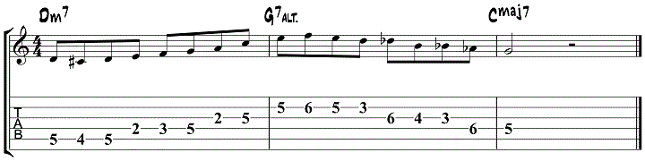
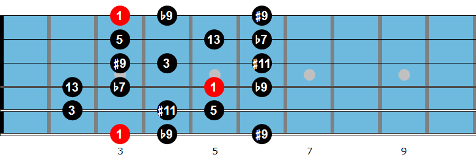
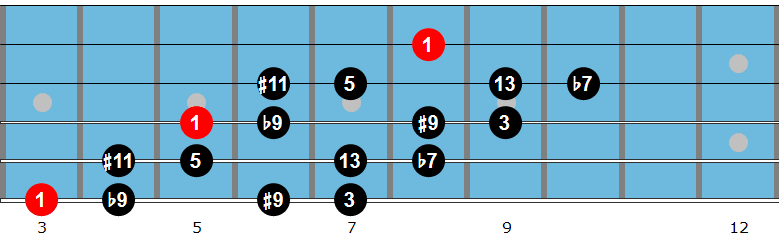
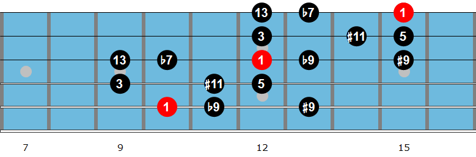
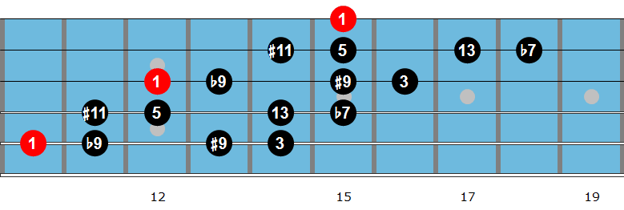

### Using half-whole diminished scale for the dominant 7th code.

### Half-whole-diminished scale

`1 - b9 - #9 - 3 - #11 - 5 -13 - b7` = `H - W - H - W - H - W - H -W`

#### Root on string 6

#### Root on string 5

**REFERENCES**

[25 Easy ii-V-I jazz guitar licks](https://www.jazzguitar.be/blog/ii-v-i-jazz-guitar-licks/)
[Dominant Diminished Scale](https://www.jazzguitar.be/blog/dominant-diminished-scale/)
