**Rootless Voicing**

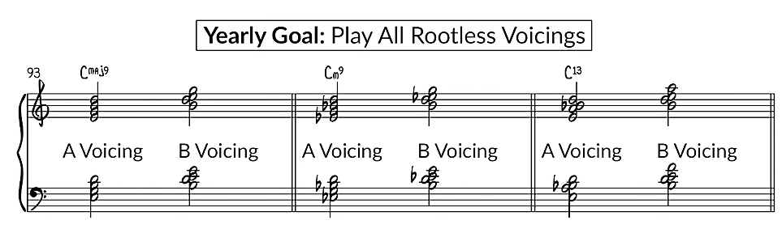
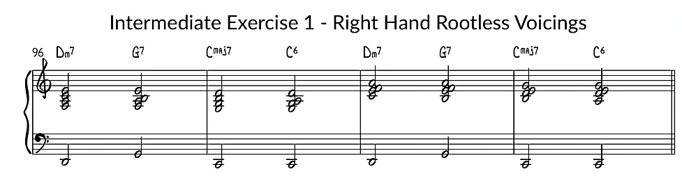
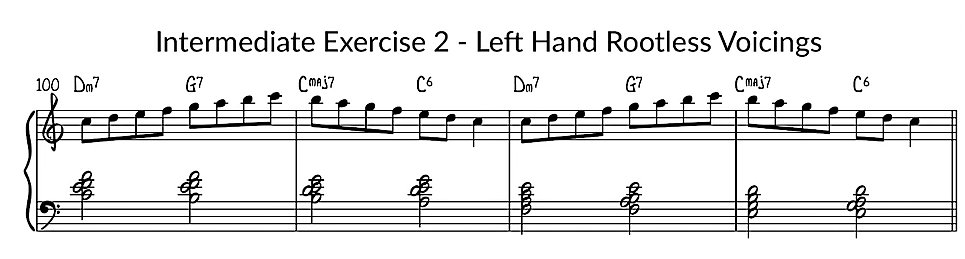

**Quartal Voicing**

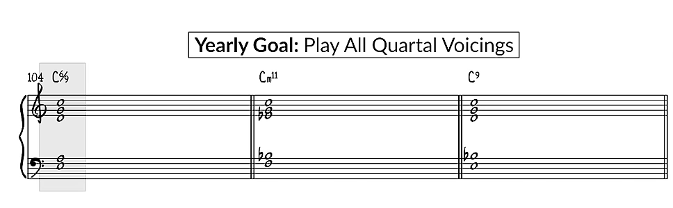
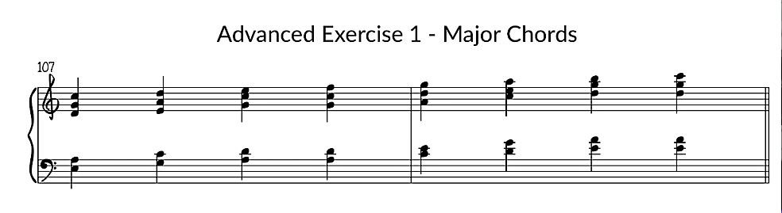
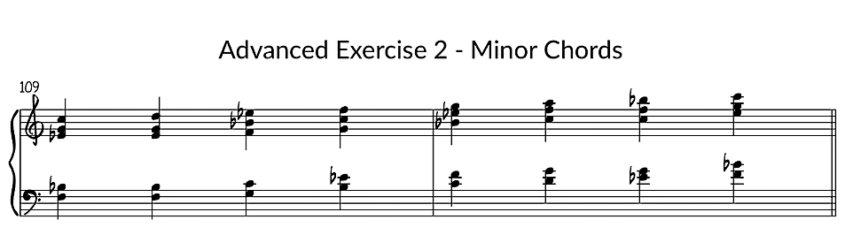
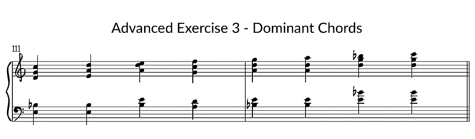

**Extension and Alterations**

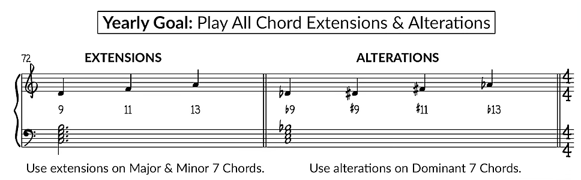
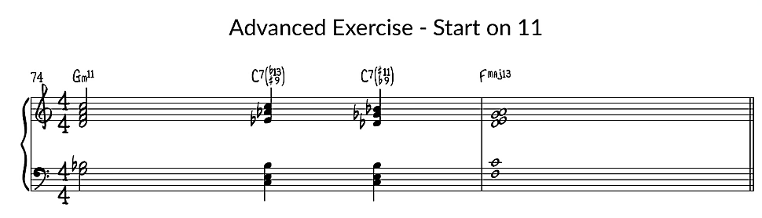
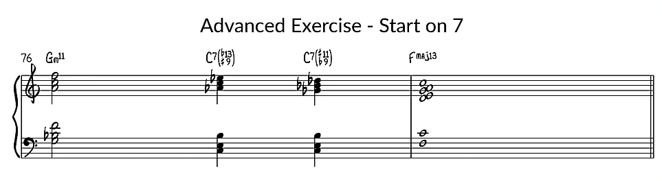
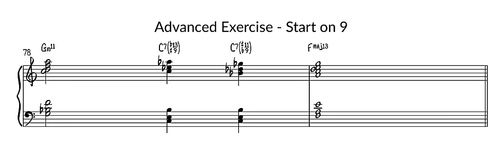

**Chord Inversion**

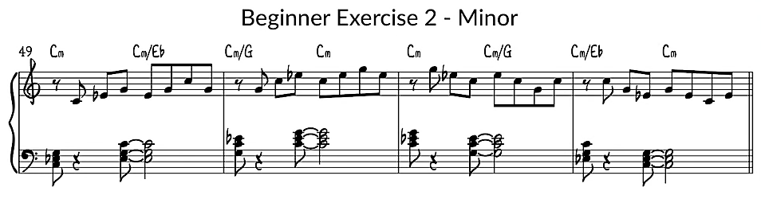
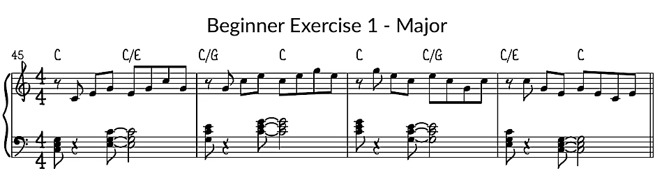

**7th Chords**

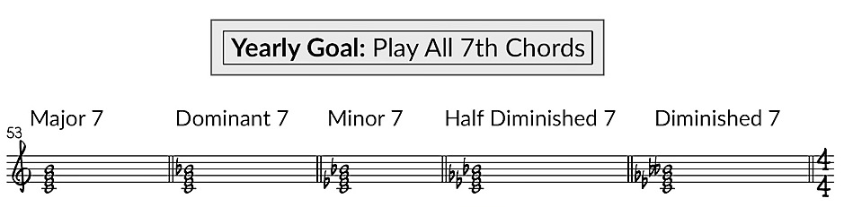
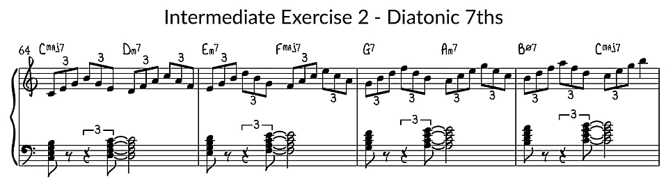

**Walking Bass & Block Chord**

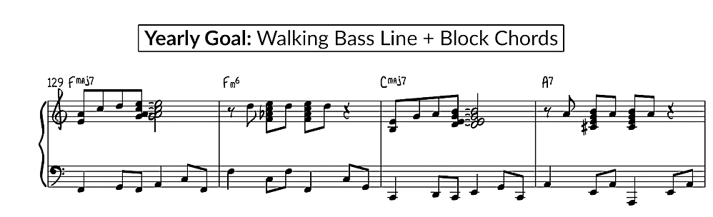

**Comping Examples**

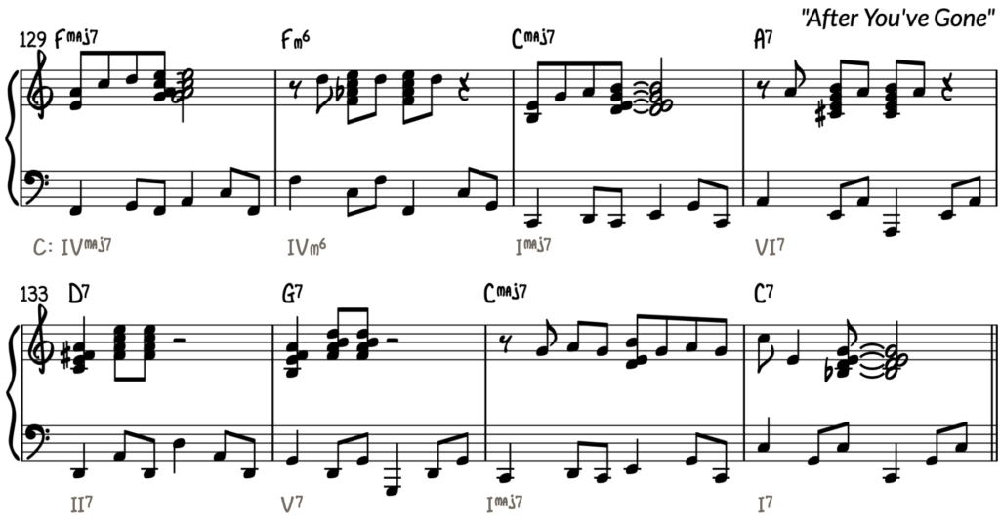
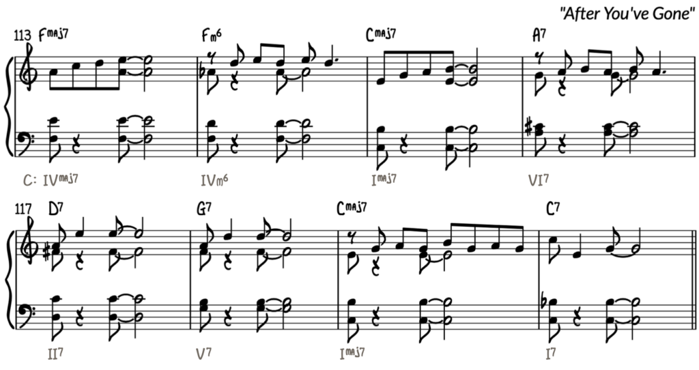

### Reference

These exercises are from Piano with Jonny website. All the exercises are from his excellent video.

[Jazz Piano 1-Year Practise Plan from Piano With Jonny](https://pianowithjonny.com/piano-lessons/jazz-piano-1-year-practice-plan/)
